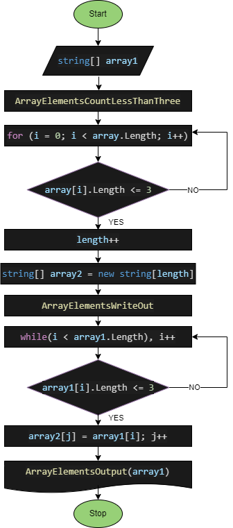

# Итоговая проверочная работа, курс Разработчик
### *ЦП группа 2981*

## **Задание:**

Написать программу, которая из имеющегося массива строк формирует новый массив из строк, длина которых меньше, либо равна 3 символам. Первоначальный массив можно ввести с клавиатуры, либо задать на старте выполнения алгоритма. При решении не рекомендуется пользоваться коллекциями, лучше обойтись исключительно массивами.

**Примеры:**
_[“Hello”, “2”, “world”, “:-)”] → [“2”, “:-)”]
[“1234”, “1567”, “-2”, “computer science”] → [“-2”]
[“Russia”, “Denmark”, “Kazan”] → []_

## **Требования к решению:**
 - Создать репозиторий на GitHub; 
 - Нарисовать блок-схему алгоритма (можно обойтись блок-схемой основной содержательной части, если вы выделяете её в отдельный метод);
 - Снабдить репозиторий оформленным текстовым описанием решения (файл README.md);
 - Написать программу, решающую поставленную задачу
 - Использовать контроль версий в работе над этим небольшим проектом.

## **Текстовое описание решения:**
 - Создать метод ArrayElementsCountLessThanThree для подсчета элементов, длина которых меньше либо равна 3 символам;

 - Создать метод ArrayElementsWriteOut для копирования элементов <=3  в новый массив;

 - Создать метод ArrayElementsOutput для вывода массивов;

 - Воспользоваться написанными выше методами для создания и вывода в консоль массива, в котором будут все строки, длина которых меньше, либо равна 3 символам (длину нового массива берем из функции ArrayElementsCountLessThanThree).

 ## **Блок-схема:**
 
